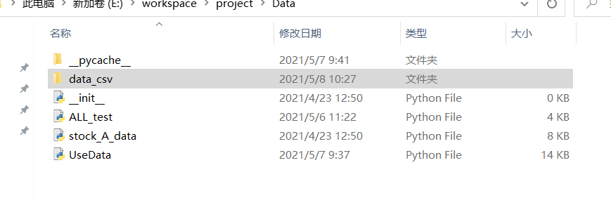

# Readme
In this experiment we tried featured based methods and factor based methods.

These are test methods
* Feature based methods
  * Naive Bayesian Method
    * GaussianNaiveBayesMethod.py
  * Linear method:
    * MultiFeatureSystemAccuracyTest.py
    * MultiFeatureSystemAccuracyTest2.py
    * MultiFeatureSystemTTest.py
  * Neural network method:
    * MultiFeatureNNAccuracyTest.py
    * MultiFeatureNNTStatisticsTest.py
  * LSTM method:  
    * KerasLSTM.py
* Factor based methods
  * CAPM.py
  * CAPMWholeMarketTest.py
  * Fama3.py
  * Fama3WholeMarket.py
  * Carhart4.py
  * Carhart4WholeMarket.py
  * Fama5.py
  * Fama5WholeMarket.py

If you want to download data, please access url:  
https://drive.google.com/file/d/15QwdW-D2HP4yjng7nl5zIxzngPVpr5MY/view?usp=sharing

After downloaded the data, you should unarchive it, and put the data_csv directory under Data directory.  
 
  

