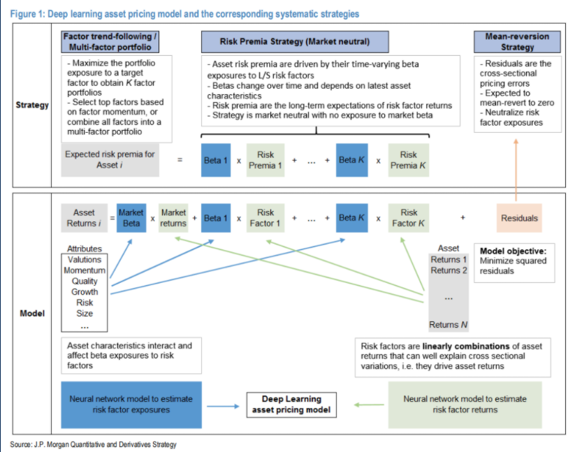
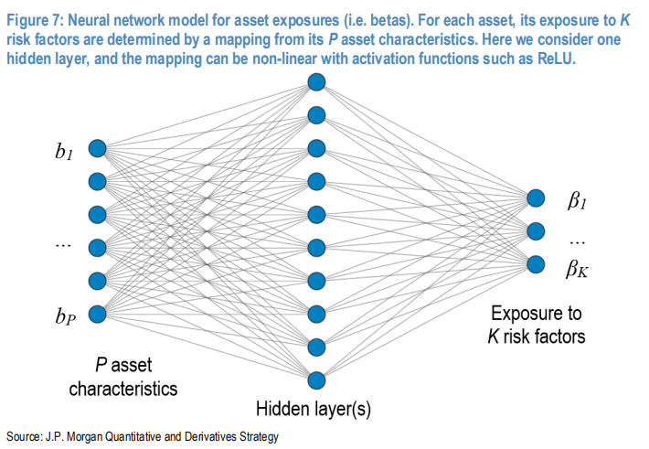
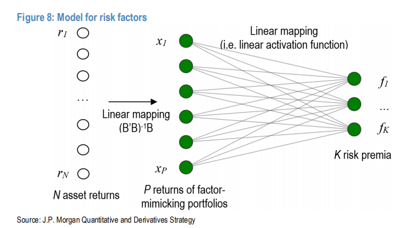
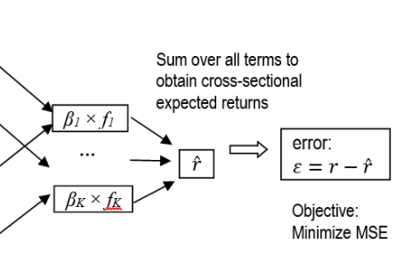

# project
<!-- TOC -->

- [project](#project)
  - [Things to do](#things-to-do)
  - [Descriptions](#descriptions)
    - [What is the multi-factor investment?](#what-is-the-multi-factor-investment)
    - [Traditional way to find factors](#traditional-way-to-find-factors)
    - [Linear Regression](#linear-regression)
    - [Time Series Analysis](#time-series-analysis)
    - [Logistic Regression](#logistic-regression)
    - [Neural Network](#neural-network)
    - [What are the factors data?](#what-are-the-factors-data)
    - [Backtest system](#backtest-system)
  - [Pricing Model](#pricing-model)
    - [Factor Analysis with Linear Regression](#factor-analysis-with-linear-regression)
      - [CAPM](#capm)
      - [Fama's 3 Factor Model](#famas-3-factor-model)
      - [Carhart four-factor Model](#carhart-four-factor-model)
      - [APT model](#apt-model)
      - [Multi Factors Model](#multi-factors-model)
    - [Factor Analysis with Neural Network](#factor-analysis-with-neural-network)
      - [Overview](#overview)
      - [Train the Factors with Neural Network](#train-the-factors-with-neural-network)
  - [Strategy](#strategy)
    - [Risk Premia Strategy](#risk-premia-strategy)

<!-- /TOC -->

## Things to do
* Collecting assets' factor data. 
* Design the methods, and try to predict data 
    * Traditional way to find the factors
    * Lienar Regression
    * Time Series Analysis
    * Logistic Regression
    * Neural Network
        * Design the neural network
        * Find the loss function
* Backtest system

## Descriptions
### What is the multi-factor investment?
Factors are the elements that affects the market price, and it varies at every moment, but there is always some factors which can describe the current asset's price. So if I can find the some effective factors, and I invest into these factors, theoeritically I can get the expected return.
### Traditional way to find factors
The most intuitive way is to order the assets by the factors. For example

### Linear Regression
So there is another way to find out whether a specific factor affects the asset's price.

### Time Series Analysis
The time series analysis consider the prices in the last serveral epochs as factors, and it tries to find the regressional relationships between current price and last several prices. 
There are two parts in the time sereis analysis, and one of them is ARMA model. Actually this model contains two models: AR(p) model and MA(q) model.  
AR(p) model:
$$
y_t = c + \phi_1y_{t-1} + \phi_2y_{t-2} + ... + \phi_py_{t-p} + \epsilon_t
$$
It shows that the price in time t has a linear relationship with prices of last epochs.

MA(q) model:
$$
y_t = \mu + \epsilon_t + \theta_1\epsilon_{t-1} + ... + \theta_q\epsilon_{t-q}
$$
It shows the price is fluctuating around the $\mu$ by the residuals of last epochs.  
ARMA model combines the AR(p) and MA(q) model
$$
y_t = c + \phi_1y_{t-1} + \phi_2y_{t-2} + ... + \phi_py_{t-p} + \epsilon_t + \theta_1\epsilon_{t-1} + ... + \theta_q\epsilon_{t-q}
$$
So we can say that ARMA(p,q) model predicts the expected $y_t$. But there is still an important part not mentioned in this model which is how to model the residual: $\epsilon_t$.

Here I use pandas to do the time series analysis.

### Logistic Regression

### Neural Network

### What are the factors data?
I use two kinds of data here:
* Cross-section data
* Time series data

The cross-section data contains 3 kinds of data:
* Aseets character data, here we can use the stock's fundamental data of financial report.
* Technical indicators
* Economics data

### Backtest system
The most important thing in the investment is to gain the excess return with minimum risk. So if I make the investment decision by the strategy, I need to a good criteria to evaluate whether this strategy is good or not. Sharpe ratio is what I want.
$$
S = \frac{E(R-r_f)}{\sigma}
$$
* S: Sharpe ratio
* R: yield of asset
* $r_f$: risk-free rate
* $\sigma$: standard deviation of asset's yield

## Pricing Model
### Factor Analysis with Linear Regression

The linear regression is a classical method to analyze how to explain the price's move with the factors. This method focuses on the cross-section data which means it doesn't care about the asset's price moves by the factor every day but only cares about how much the asset is exposed to a specific factor(risk).  
It is a pricing model, so our goal is to predict the stock's future price.
#### CAPM
For example, the classical CAPM model  
$$
E(R_p) = R_f + \beta(R_m - R_f)
$$
The line represents this relationship is called Security Market Line(SML).  
  

Apparently it is an application of linear regression. But how to do this regression in practice?  
The factor analysis studies on the cross-section data, but the stock prices is a time series data. So I have price series of a stock and the price series of HS300 etf.
$$
E(r_p) = \alpha + \beta( R_m - R_f )  \\
R_p = \frac{\Delta P_t^{stock}}{P_{t-1}^{stock}} - 1  \\
R_m = \frac{\Delta P_t^{etf}}{P_{t-1}^{etf}} - 1 
$$
So I can do the regression with a time period. If I find that:
$$
r_p = r_f + \beta(r_m - r_f) + \alpha
$$
  
So if the $R_p$ is above SML( eg. point B), that means the market accept a higher return associates with the market risk, then this security is undervalued. And if $r_p$ is under SML (eg. point A), that means the market accepts a low return associates with market risk.
#### Fama's 3 Factor Model
From CAPM model's view, the return of a stock derives only from the market's return, or we can say that the market risk is the only risk. But  in 1993 Fama and French public another model which extends the CAPM introducing SMB and HML
$$
R_p - R_f = \alpha_p + \beta (R_m - R_f) + b_s \cdot SMB + b_v \cdot HML + \epsilon
$$
It is obviously a linear regression application. Comparing to CAPM, it introduces two new factors: SMB and HML.  
* $\alpha_p$ : The excessive expcted return of the portfolio 
* $\beta,b_s,b_v$: The weights of the factors which represent the sensitivities to these factors.
* $R_m-R_f$: Expected excess return
* SMB: Size premium. It is the the average return of the small market cap stocks minus the average return of big market cap stocks
* HML: value premium. It is the average return of high book-cap ratio stocks minus the average return of look book-cap ratio stocks

#### Carhart four-factor Model

With factors, we can can calculate the risk exposure of a portfolio. It is very important to the investing. When I calculate the exposures to factors, I can collect securities with highly positive exposures to specific factors, and 
$$
R_p - R_f = a_p + \beta_{p1} (R_m - R_f) + \beta_{p2} SMB + \beta_{p3}HML + \beta_{p4}WML + \epsilon_t
$$
In this formula
* WML: Momentum factor, which is the average return of the winners minus the average return of the losers last year

Carhart 4 factor model and the 3 factor model both have intersection items "$\alpha_p$" which represent the expected return when $\beta$s are zeroes. So if I have a portfolio named A which is exposed to these 4 factors, also having an expected return $\alpha_p$. In the market, I can find many assets with which I build another portfolio named B follows:
$$
R_p' - R_f = \alpha_p' +  \beta_{p1} RMRF + \beta_{p2} SMB + \beta_{p3}HML + \beta_{p4}WML + \epsilon_t
$$
When $\alpha_p' < \alpha_p$, I can long the portfolio B and short the portfolio A, then I can get
$$
R = R_p' - R_p = \alpha_p' - \alpha_p
$$
It is the risk-free return because this new portfolio has no exposure to any risks. And this operation is called arbitrage. When this opportunity exists in the market, investors will do the arbitrage until the opportunity disappears.  
So if the market is efficient, there is no arbitrage opportunity here.
$$
E(R_p - R_f) = \beta_{p1} RMRF + \beta_{p2} SMB + \beta_{p3}HML + \beta_{p4}WML
$$
#### APT model
As we see these models above, we can find out the something common. 
$$
R_i = R_f + a_i + \beta_{i1}I_1 + \beta_{i2}I_2 + ... + \beta_{ik}I_K + \epsilon_i
$$
This is called APT(Arbitrage Pricing Theory) model. When the market is efficient
$$
E(R_i) = R_f + \beta_{i1}I_1 + \beta_{i2}I_2 + ... + \beta_{ik}I_K
$$
#### Multi Factors Model
The APT model gives us a formula to attribute the return to the factors, but we still need to exploit the factors by ourselves.  
The multi factor model gives us a guideline of exploiting factors:
* Macro-economical Factors
* Fundamental Factors
* Statistical Factors

### Factor Analysis with Neural Network
#### Overview
I introduces some traditional models which needs us to design the factors, and train the model with linear regression. Now neural network can help us to build a complex model in order to do the precise pricing.  
  
In this image, there are two parts named 'Model' and 'Strategy'.  
The model part is the multi factor model mentioned above. And with the model defined there are 3 kinds of strategies.
* Factor trend-following/Multif-factor portfolio
* Risk Premia Strategy(Market neutral)
* Mean-reversion Strategy

The first thing is to define model.
#### Train the Factors with Neural Network
  
The paper named "Risk Premia Investing in the Age of Machines" introduces another way to build the factor model.  

So in this model, I input the asset characteristics and their returns instead of designing the factor. There are two neuron networks, and one of them is to train the risk factor, and the other one is to train the risk exposure.   
  
The first part of the neural network is built for training the exposure to risk factors($\beta$). The input are the characteristics for assets. In this image, there are P asset characteristics. And the output is the exposure to K factors. K is a hyperparameter. With this neural network, I can get $\beta$s.  
  
The second part of the neural network is built for finding out the factors. The input of this NN is N asset returns, and after that these N asset returns is a linear mapped to P returns of factor-mimicking portfolios. So the factors are the linear combinations of these mimicking portfolios.  
  
After that I build the multi factor model with linear combination estimate the return. The loss function is the MSE of the extimatd return and the true return.  
This strategy is market neutral which means it doesn't have an exposure to the market risk.  
With this pricing model, I can build the strategy upon it.

## Strategy
So with the factors and weights from APT model or Neural Network model
$$
R_i = R_f + a_i + \beta_{i1}I_1 + \beta_{i2}I_2 + ... + \beta_{ik}I_K + \epsilon_i
$$
I can build the strategy.

### Risk Premia Strategy
$$
\begin{aligned}
Expected\ risk\ premia\ of\ r_{t+1}^i &= (\beta_{1,t}^i \times E[f_{1,t+1}]) + ... + (\beta_{K,t}^i \times E[f_{K,t+1}])  \\
&= (\beta_{1,t}^i \times \hat \lambda_{1,t}) + ... + (\beta_{K,t}^i \times \hat \lambda_{K,t})
\end{aligned}
$$
* Expected risk premia of $r_{t+1}^i$: The expected return of asset i at time t+1
* $\beta_{1,t}^i$: the risk exposure of the ith asset at time t
* $E[f_{1,t+1}]$: The first factor's risk premia of time t+1

So the next question is how to calculate $E[f_{1,t+1}]$:
$$
\hat\lambda_{K,t} = \frac{1}{t}\sum_{j=1}^tf_{K,j}
$$
So we have the singal
$$
Signal = Expected\ risk\ premia\ of\ r_{t+1}^i
$$
The signal is the expected return of asset i, so I can rank the assets into 10 long-only, equal-weighted portfolios in ascending order.  

